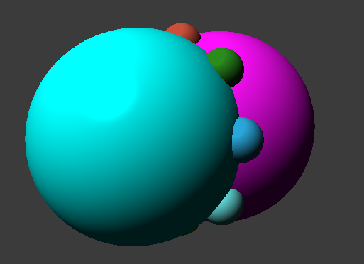
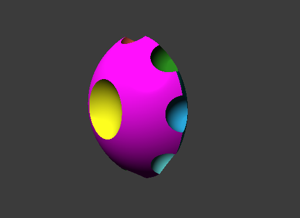
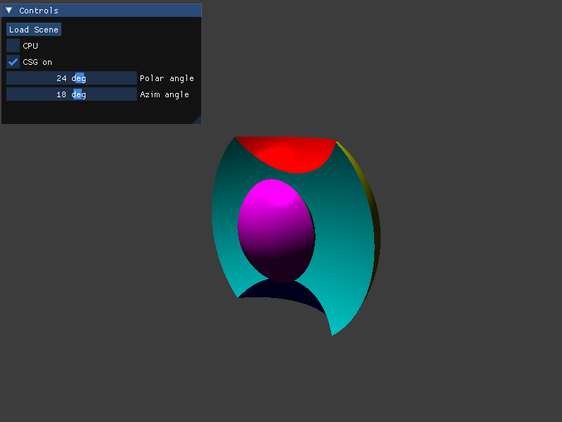

# CSG raycasting with CUDA
This application allows displaying real-time CSG Scene loaded from `.json` file. The user can rotate/move the camera to see the scene from different angles and change the direction of a directional light.

[CSG](https://en.wikipedia.org/wiki/Constructive_solid_geometry) (Constructive Solid Geometry) allows a modeler to create 
a complex surface or object by using Boolean operators (union, intersection and difference) to combine simpler objects (wikipedia).

The CSG raycasting algorithm has been implemented using CUDA and is based on the [Spatially Efficient Tree Layout for GPU Ray-tracing of
Constructive Solid Geometry Scenes](https://www.semanticscholar.org/paper/Spatially-Efficient-Tree-Layout-for-GPU-Ray-tracing-Ulyanov-Bogolepov/8e29e7a9ee23ae587a4ee6e6ecd25cc32266499a) paper by D.Y. Ulyanov, D.K. Bogolepov and V.E. Turlapov.

| CSG off | CSG on |
|---|---|
|||

| The application |
|---|
||

## Limitations
1. The json file format is a little bit akward for now, since it is array representation of a binary tree.
2. There is only sphere support implemented.
3. There is no editor.

## 3rd party libraries
- [imgui](https://github.com/ocornut/imgui)
- [nlohmann/json](https://github.com/nlohmann/json)
- [dirent](https://github.com/tronkko/dirent/tree/master)
- [ImGuiFileDialog](https://github.com/aiekick/ImGuiFileDialog)

## Usage
- To control the direction of light incidence, use the Polar/Azim angle parameters accessible in the Controls window,
- To enter camera mode, hold down the right mouse button,
- In camera mode, you can adjust its direction using the mouse,
- In camera mode, you can change its position in space using the W, S, A, D, Q, and E keys,
- To load sample trees, use the Load Scene button,
- Sample .json files are located in the res folder.

## Requirements
You need [NVIDIA CUDA GPU](https://developer.nvidia.com/cuda-gpus) to run the application. This application has been tested on the following GPU's: 
| GPU | Memory | Compute Capability |
|---|---|---|
| NVIDIA GTX 1650Ti  | 4GB | 7.5 |
| NVIDIA GTX 1060  | 3GB | 6.1 |
| NVIDIA GTX 1070  | 8GB | 6.1 |

## Compilation Guide
In order to compile the project you need to download and install [NVIDIA CUDA Toolkit](https://developer.nvidia.com/cuda-downloads) and [CMake](https://cmake.org/) first.

### Linux
1. Clone the repository to the desired location `git clone https://github.com/migoox/boids-simulation`,
2. Navigate to the cloned directory and run `cmake .`,
3. Run `make`.
### Windows
1. Clone the repository to the desired location `git clone https://github.com/migoox/boids-simulation`,
2. Navigate to the cloned directory and run `cmake .`,
3. Open `boids_simulation.sln` using Visual Studio,
4. Set `boids_simulation` as the Startup Project (right click on `boids_simulation` and choose `Set as Startup Project`),
5. Compile using Debug/Release mode.
